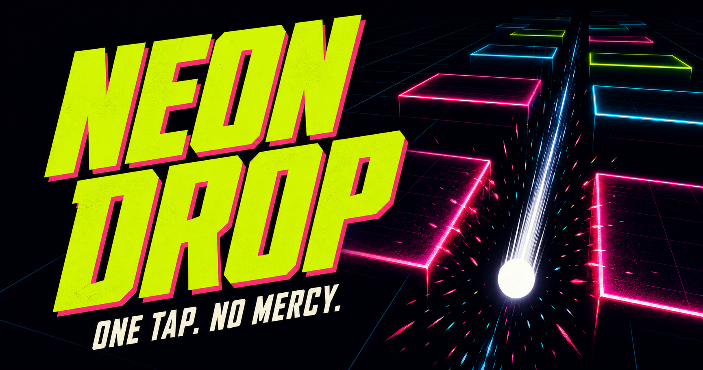

# NEON DROP

  

<strong>One thumb. Zero excuses.</strong>

NEON DROP is a fast mobile arcade game built around one simple movement. Drag
the glowing ball left and right, read each gate, find the safest line and keep
the run alive as the speed and pressure increase.

The game is designed for short sessions, immediate restarts and long term
score chasing. It runs directly in a modern browser and can also be installed
as a fullscreen Progressive Web App.

## Play now

https://donacgreece.github.io/NeonDrop/

No account or initial download is required.

## How to play

1. Touch or click the game area.
2. Drag left and right to control the ball.
3. Pass through the opening of every approaching gate.
4. Aim for the exact center to earn Perfects and build a combo.
5. Protect all three lives and push the score as far as possible.

The controls are intentionally simple. The challenge comes from precision,
timing, changing gate behavior and decision making at higher speeds.

## Gameplay

Every run develops differently through a combination of standard gates,
moving patterns, shrinking openings, speed bursts and recovery moments. Risk
Gates offer a more dangerous route with a larger score reward. Precision Cores
reward exact positioning, while Boss Sequences test consistency across several
connected gates.

Perfect passes build a combo multiplier. Longer streaks activate increasingly
powerful Neon Rush levels and special audiovisual feedback. A Combo Shield can
protect a strong streak from one imperfect pass, but it never protects the
player from a collision.

Rare Mystery Gates add controlled unpredictability. Their reward is revealed
only after the player commits to the gate and can affect scoring, gate width or
the current Rush state.

## Progression and ball collection

NEON DROP does not use a repetitive coin system. New balls are unlocked by
completing meaningful achievements such as reaching score milestones, landing
Perfects, taking Risk Gates and surviving special events.

Each unlocked ball has its own visual identity and trail. Continued use builds
Ball Mastery, which improves its trail and animation without changing gameplay
power. Every player therefore competes under the same rules.

## Challenges and sharing

After a run, players can create a personal challenge link and a dynamic score
card. A friend opening the link sees the challenger, the score to beat and an
Accept Challenge action. The target remains visible during the run and the
result clearly shows whether the challenge was won.

Sharing uses the device's native share menu when available. On supported
devices, the generated NEON DROP score card is included as an image.

## Features

1. Smooth one finger controls for mobile and desktop
2. Fast restarts and short arcade sessions
3. Perfect combos, Combo Shield and progressive Neon Rush
4. Risk Gates, Mystery Gates, Precision Cores and Boss Sequences
5. Six achievement based balls with individual mastery progression
6. Distinctive trails, particles, sound feedback and optional haptics
7. On device Top 10 leaderboard
8. Personal challenge links and dynamic score cards
9. Adjustable sound, vibration, screen shake and flash effects
10. Fullscreen installation as a Progressive Web App
11. Automatic PWA updates without requiring reinstallation
12. Responsive layouts for different phone sizes

## Privacy

NEON DROP requires no account. The player name, personal best, local Top 10,
settings, unlock progress and Ball Mastery remain in the browser storage of the
player's device.

The website uses Google Analytics to understand general usage and gameplay
performance. Analytics data is separate from the local leaderboard and does
not create a public player profile.

## Project status

NEON DROP is actively developed. The browser version is live and installable,
with ongoing work focused on gameplay balance, mobile responsiveness, player
retention and fair monetization.

The production ready static game is located in `web/` and is deployed to GitHub
Pages from the `main` branch.

## Copyright

Copyright © 2026 Donacgreece. All rights reserved.

This repository is publicly accessible for source review and deployment
transparency only. No permission is granted to copy, modify, redistribute,
repackage or commercially use the project. See [COPYRIGHT.md](COPYRIGHT.md) for
the complete notice.
